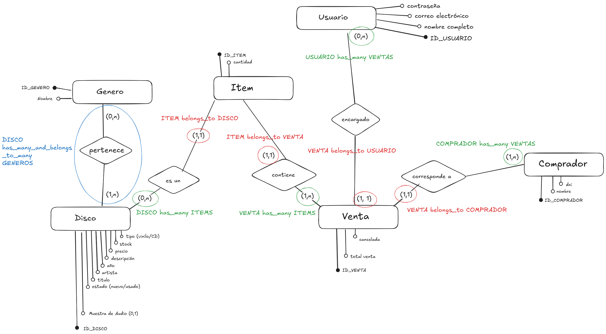

# Ruby on Records

```text
` ♫⋆｡♪.✧₊˚♬⋆♭ ´   ______      _                          ______                       _
 ` _________ ´   | ___ \    | |                         | ___ \                     | |
` /_|_____|_\ ´  | |_/ /   _| |__  _   _    ___  _ __   | |_/ /___  ___ ___  _ __ __| |___
  '. \   / .'    |    / | | | '_ \| | | |  / _ \| '_ \  |    // _ \/ __/ _ \| '__/ _` / __|
    '.\ /.'      | |\ \ |_| | |_) | |_| | | (_) | | | | | |\ \  __/ (_| (_) | | | (_| \__ \
      '.'        \_| \_\__,_|_.__/ \__, |  \___/|_| |_| \_| \_\___|\___\___/|_|  \__,_|___/
                                    __/ |
                                    |___/
```

## Descripción

Una aplicación de gestión de inventario pensado para una disquería que vende CDs y vinilos, tanto nuevos como usados.
La aplicación permitirá al personal del negocio administrar el stock de productos y asentar ventas. Además, incluirá una página pública que permita al público ver el catálogo de discos que la tienda ofrece.

## Requisitos técnicos

* Ruby 3.4.5
* Rails 8.1.1
* SQLite3

#### Para instalar la aplicación y sus dependencias:

```bash
  git clone git@github.com:holafrank/ruby_on_records.git
  cd ruby_on_records

  # Instalar dependencias
  bundle install
```

#### Para poblar la base de datos:

```bash
  # Para crear y migrar la base de datos por primera vez
  rails db:create
  rails db:migrate
  rails db:seed

  # Para borrar y volver a poblar la base de datos nuevamente
  rails db:reset
  rails db:seed
```

#### Para levantar la aplicación localmente:

```bash
  cd ruby_on_records
  rails s
  # Acceder a http://localhost:3000/ desde un navegador
  # Para detener la ejecución de la aplicación usar Ctrl-Z
```

## Decisiones de diseño

### Diagrama

Este es un diagrama de las etapas tempranas de diseño de la base de datos. Éste contiene los modelos que representan a los Discos, Géneros, Items, Ventas, Usuarios y Compradores.



#### Modelo para discos

Los [Discos](app/models/disk.rb) son el producto trabajado por Ruby on Records. El modelo implementa las _validaciones_ pertinentes para poder dar de alta o editar un disco.

Además, el modelo provee varios _scopes_ para poder obtener los discos más vendidos, los más nuevos y aquellos discos que tengan el stock más bajo, también hay _scopes_ dedicados al filtrado de discos según varios atributos disitintos. Al ser encadenables, los _scopes_ permiten ser llamados uno después de otro dentro del controller. Con este enfoque modular, podemos agregar nuevos filtros o quitar/editar filtros.

Por último los _métodos de instancia_ permiten obtener información o modificar el estado de una instancia en concreto de un disco.

###### Aclaraciones y otras decisiones de diseño:

* El borrado lógico de Discos es reversible. Al "dar de baja" a un Disco, su stock se deja en "0". Pero al ser "restaurado" nuevamente, su stock se establece automáticamente a "1". En caso de requerir modificar su stock actual, se debe editar en su correspondiente ruta `/edit`
* Los Discos "Usados" pueden tener como máximo un ejemplar.

#### Módulo de ventas (Items & Sales)

Las [Ventas](app/models/sale.rb) consisten en uno o varios [Items](app/models/item.rb) que representan un producto (Disco) y la cantidad vendida del mismo, así como un Cliente y un Vendedor.

Al generar una nueva venta, el modelo de Venta se encarga de "unificar" los Items que se desean comprar. Con "unificar", nos referimos a asegurarnos de que todos los Items que correspondan a un mismo Disco aparezcan como uno sólo, con sus respectivas cantidades sumadas. El _método de instancia_ del modelo Sale `unify_items!` se encarga de unificar los Items a través del método `group_items()`. Usando un Hash que toma como clave el ID del disco que pertenece a ese Item, se pueden acumular las cantidades totales de ejemplares que se desean comprar de cada Disco en caso de que el Vendedor haya creado la Venta como varios Items iguales.

El modelo de Ventas a su vez utiliza _validaciones_ y _callbacks_ para garantizar consistencia entre stock y precio total de las ventas en disitntas instancias, por ejemplo al cancelar o editar una Venta.

###### Aclaraciones y otras decisiones de diseño:

* La cancelación de Ventas es **irreversible**.

#### Módulo de usuarios y clientes (Users & Clients)

Los permisos son manejados a través de la biblioteca/gema [CanCanCan](https://rubygems.org/gems/cancancan/versions/3.6.1). En el modelo [Ability](app/models/ability.rb) se describe e implementan los permisos de cada usuario y de los clientes que sólo acceden al portal publico.

Para el sistema de log-in y registro de nuevos usuarios fue implementado con la biblioteca/gema [bcrypt](https://rubygems.org/gems/bcrypt), que provee facilidades para la autenticación y hasheo de contraseñas. El log-in se maneja en [sessions_controller](app/controllers/sessions_controller.rb). Por otro lado, el registro de nuevos usuarios y la suspensión de usuarios ya existentes se maneja en el modelo de [Usuarios](app/models/user.rb) y en su controlador.

Dada la escala y contexto del sitio que se nos encargó, consideramos que usar [Devise](https://rubygems.org/gems/devise) podía llegar a ser demasiado. Sin embargo, si a futuro se desea implementar un sistema de registro y log-in para Clientes, aumentando notoriamente la escala y complejidad, entonces usar _Devise_ puede ser lo más indicado.

###### Aclaraciones y otras decisiones de diseño:

* La suspensión de Usuarios es reversible.
* La suspensión de un Usuario no afecta a las Ventas realizadas por éste. Sólo evita que pueda iniciar sesión.

#### Módulo de facturas (Invoices)

La generación de facturas en formato `.pdf` es manejada por el modelo [invoice_pdf_generator](app/services/invoice_pdf_generator.rb) y manejada por el controlador [invoices_controller](app/controllers/backstore/invoices_controller.rb).

###### Aclaraciones y otras decisiones de diseño:

* No se puede emitir factura de una Venta cancelada.
